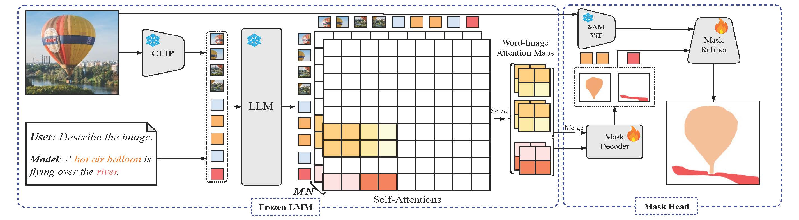

# F-LMM: Grounding Frozen Large Multimodal Models

## Introduction

This is the official release of paper **F-LMM: Grounding Frozen Large Multimodal Models**. 
It is currently under construction.

> [**F-LMM: Grounding Frozen Large Multimodal Models**](https://arxiv.org/abs/2406.05821),            
> Size Wu, Sheng Jin, Wenwei Zhang, Lumin Xu, Wentao Liu, Wei Li, Chen Change Loy            
> [Bibtex](https://github.com/wusize/F-LMM#citation)

## TODO
- [x] Training code
- [x] Evaluation code and checkpoints
- [ ] Interactive Demo

## Dependencies

1. This project is built on [Xtuner](https://github.com/InternLM/xtuner). The segmentation modules 
including the U-Net and training losses are 
from [MMSegmentation](https://github.com/open-mmlab/mmsegmentation) and 
[MMDetection](https://github.com/open-mmlab/mmdetection). Please refer to the official documents of these toolkits for installation guidance.

2. The version of [transformers](https://github.com/huggingface/transformers) used in this project is v4.39.1. And we
find using versions beyond v4.40.0 cannot reproduce the performances (we are debugging on this issue). 

3. Accelerate is used to build the evaluation pipeline of our models. Please refer to its official
[webpage](https://github.com/huggingface/accelerate) for installation.

## Data Preparation
**[PNG](https://github.com/BCV-Uniandes/PNG) Dataset.** Download images `train2017` and `val2017`
from COCO's official [website](https://cocodataset.org/#home) and put them under `data/coco`. Download annotation
files `png_coco_train2017.json` and `png_coco_val2017.json` from PNG's project [page](https://bcv-uniandes.github.io/panoptic-narrative-grounding/#downloads) 
and put them under `data/coco/annotations`. Download mask annotations `panoptic_train2017(.json)` and `panoptic_val2017(.json)` from
COCO's official [website](http://images.cocodataset.org/annotations/panoptic_annotations_trainval2017.zip) and put
them under `data/coco/annotations`.

**[RefCOCO Series](https://github.com/lichengunc/refer).** Please refer to MMDetection's
[tutorial](https://mmdetection.readthedocs.io/en/latest/user_guides/dataset_prepare.html#refcoco-dataset-preparation)
to prepare RefCOCO datasets.


**[VisCoT](https://github.com/deepcs233/Visual-CoT).** We have prepared the test images under 
[Google Drive](https://drive.google.com/drive/folders/1j25nY7i47OudmyzZFyps8NmzVHx6sf5O?usp=drive_link). Download and
extract the zip files under `data/cot`.

```text
F-LMM/
├── data
    ├── cot
    ├── coco
        ├── annotations
            ├── panoptic_train2017.json
            ├── panoptic_val2017.json
            ├── png_coco_train2017.json
            ├── png_coco_val2017.json
            ├── panoptic_train2017     # panoptic masks
            ├── panoptic_val2017     # panoptic masks
        ├──refcoco
            ├──instances.json
            ├──refs(unc).p
        ├──refcoco+
            ├──instances.json
            ├──refs(unc).p
        ├──refcocog
            ├──instances.json
            ├──refs(umd).p
        ├── train2017
        ├── val2017
        ├── train2014
```


## Checkpoints
**SAM.** Please obtain the checkpoint `sam_vit_l_0b3195.pth` of pretrained SAM model from SAM's official
[webpage](https://github.com/facebookresearch/segment-anything#model-checkpoints).

```text
F-LMM/
├── checkpoints
    ├── sam_vit_l_0b3195.pth
```
**Large Multimodal Models.** Models of off-the-shelf LMMs can be automatically downloaded from huggingface when running
training or evaluation.


## Run

### Train

```shell
export PYTHONPATH=.
NPROC_PER_NODE=8 xtuner train configs/deepseek_vl/frozen_deepseek_vl_1_3b_chat_unet_sam_l_refcoco_png.py --deepspeed deepspeed_zero2
```

Currently, there are bugs when deepspeed_zero3 is used, we are going to resolve this issue in the future.

### Test
**Checkpoints.**
The checkpoints of our trained models are available on 
[Google Drive](https://drive.google.com/drive/folders/1bvrDqm9m4MvcocuwvvkGf_qYRBfvr0K7?usp=sharing). Download and put
them under `checkpoints/`.

| #  |          LMM         |                                                            Configs                                                             |                                         Checkpoints                                         |
|:--:|:---------------------:|:------------------------------------------------------------------------------------------------------------------------------:|:-------------------------------------------------------------------------------------------:|
| 1  |     LLaVA-1.5-7B          |    [frozen_llava_1_5_vicuna_7b_unet_sam_l_refcoco_png](configs/llava/frozen_llava_1_5_vicuna_7b_unet_sam_l_refcoco_png.py)     | [model](https://drive.google.com/file/d/1opjFe15B5L5JJ78gE_FsXvDnwSlwSHhh/view?usp=sharing) |
| 2  | LLaVA-Next-Vicuna-7B      |                       [frozen_llava_next_vicuna_7b_unet_sam_l_refcoco_png](configs/llava_next/frozen_llava_next_vicuna_7b_unet_sam_l_refcoco_png.py)                       | [model](https://drive.google.com/file/d/1N-olLqhZdPEySt8Asu2cvLJBaL1VHTqa/view?usp=drive_link) |
| 3  | LLaVA-Next-Mistral-7B      |                      [frozen_llava_next_mistral_7b_unet_sam_l_refcoco_png](configs/llava_next/frozen_llava_next_mistral_7b_unet_sam_l_refcoco_png.py)                       | [model](https://drive.google.com/file/d/13rHaEZ62Q-VX5iKhOQnlm4yH1TMOBalH/view?usp=drive_link) |
| 4  |    DeepSeekVL-1.3B         |                      [frozen_deepseek_vl_1_3b_chat_unet_sam_l_refcoco_png](configs/deepseek_vl/frozen_deepseek_vl_1_3b_chat_unet_sam_l_refcoco_png.py)                      | [model](https://drive.google.com/file/d/1UXcjJrrpTm1bNphvPNjvol9gUfvzNbjA/view?usp=drive_link) |
| 5  |     DeepSeekVL-7B         |                       [frozen_deepseek_vl_7b_chat_unet_sam_l_refcoco_png](configs/deepseek_vl/frozen_deepseek_vl_7b_chat_unet_sam_l_refcoco_png.py)                       | [model](https://drive.google.com/file/d/1LOwIAYVyR51e34ksV9jz-GGiFfmkZLj_/view?usp=drive_link) |
| 6  |     MiniGemini-2B       |                              [frozen_mgm_gemma_2b_unet_sam_l_refcoco_png](configs/mgm/frozen_mgm_gemma_2b_unet_sam_l_refcoco_png.py)                               | [model](https://drive.google.com/file/d/13wHk-dHa4in1rfIRzKCf-xEHwhaCz_6Y/view?usp=drive_link) |
| 7  |     MiniGemini-7B       |                              [frozen_mgm_vicuna_7b_unet_sam_l_refcoco_png](configs/mgm/frozen_mgm_vicuna_7b_unet_sam_l_refcoco_png.py)                              | [model](https://drive.google.com/file/d/1Gg57bLJfx2zvYQyyE7Fjfw3hCq9ucVyN/view?usp=drive_link) |
| 8  |   MiniGemini-HD-7B      |                            [frozen_mgm_vicuna_7b_hd_unet_sam_l_refcoco_png](configs/mgm/frozen_mgm_vicuna_7b_hd_unet_sam_l_refcoco_png.py)                             | [model](https://drive.google.com/file/d/1CDRI1l0FdTra7EZH_NNEha_QfA2cdbYb/view?usp=drive_link) |
| 9  |        HPT-Air           |                                 [frozen_hpt_air_unet_sam_l_refcoco_png](configs/hpt/frozen_hpt_air_unet_sam_l_refcoco_png.py)                                 | [model](https://drive.google.com/file/d/1_gU4olEjsYvBvcq6yWGklSxNAv-Yz44T/view?usp=drive_link) |
| 10 |      HPT-Air-1.5          |                               [frozen_hpt_air_1_5_unet_sam_l_refcoco_png](configs/hpt/frozen_hpt_air_1_5_unet_sam_l_refcoco_png.py)                               | [model](https://drive.google.com/file/d/1Q-asMx7C3onXnmxqEZzecMHHCccqkzaP/view?usp=drive_link) |


**Panoptic Narrative Grounding (PNG).**
```shell
export PYTHONPATH=.
accelerate launch scripts/multiprocess_eval_png.py \
 configs/deepseek_vl/frozen_deepseek_vl_1_3b_chat_unet_sam_l_refcoco_png.py \
  --checkpoint checkpoints/frozen_deepseek_vl_1_3b_chat_unet_sam_l_refcoco_png.pth
```
**Referring Expression Segmentation (RES).**
```shell
export PYTHONPATH=.
accelerate launch scripts/multiprocess_eval_refcoco.py \
 configs/deepseek_vl/frozen_deepseek_vl_1_3b_chat_unet_sam_l_refcoco_png.py \
  --checkpoint checkpoints/frozen_deepseek_vl_1_3b_chat_unet_sam_l_refcoco_png.pth --concat
```
**Visual Chain-of-Thought Reasoning.**

For now we only implement VisCot on DeepSeekVL models that work well with 
multi-image inputs. Some examples of visual cot is shown below.


***1. Inference.*** 
```shell
export PYTHONPATH=.
accelerate launch scripts/visual_cot/visual_cot_inference.py configs/deepseek_vl/frozen_deepseek_vl_1_3b_chat_unet_sam_l_refcoco_png.py \
--checkpoint checkpoints/frozen_deepseek_vl_1_3b_chat_unet_sam_l_refcoco_png.pth \ 
--version v1 --save_folder the/directory/of/result/json/files  --discard_sam
```

***2. Evaluate using ChatGPT.***
```shell
export OPENAI_API_KEY="your_openai_api_key"
python scripts/visual_cot/gpt_eval_cot_score_single.py --result_file a/single/json/file  # evaluate a single json file
python scripts/visual_cot/gpt_eval_cot_score.py --result_dir the/directory/of/all/json/files  # evaluate all json files
```


## Demo

**Grounded Human-AI Conversation**. An interactive demo is coming soon. Below are some examples of grounded conversation.


## Citation

```bibtex
@misc{wu2024flmm,
      title={F-LMM: Grounding Frozen Large Multimodal Models}, 
      author={Size Wu and Sheng Jin and Wenwei Zhang and Lumin Xu and Wentao Liu and Wei Li and Chen Change Loy},
      year={2024},
      eprint={2406.05821},
      archivePrefix={arXiv},
      primaryClass={cs.CV}
}
```

## License
This project is licensed under [NTU S-Lab License 1.0](LICENSE).

## Acknowledgement

This project is impossible without open-source efforts of large multimodal models in the community, including 
[LLaVA](https://huggingface.co/llava-hf), [DeepSeek-VL](https://github.com/deepseek-ai/DeepSeek-VL), 
[MiniGemini](https://github.com/dvlab-research/MGM) and [HPT](https://github.com/HyperGAI/HPT). In addition, we also 
thank open-source code bases from [transformers](https://github.com/huggingface/transformers) and 
[openmmlab](https://github.com/open-mmlab) teams that facilitate the development of this project.

