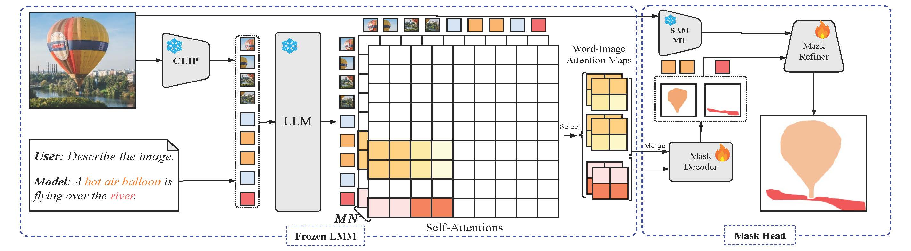

# F-LMM: Grounding Frozen Large Multimodal Models

## Introduction

This is the official release of paper **F-LMM: Grounding Frozen Large Multimodal Models**. 
It is currently under construction.

> [**F-LMM: Grounding Frozen Large Multimodal Models**](https://arxiv.org/abs/2406.05821),            
> Size Wu, Wenwei Zhang, Lumin Xu, Sheng Jin, Wentao Liu, Wei Li, Chen Change Loy            
> [Bibetex](https://github.com/wusize/F-LMM#citation)

## TODO
- [ ] Training code
- [ ] Evaluation code and checkpoints
- [ ] Interactive Demo

## Dependencies

1. This project is built on [Xtuner](https://github.com/InternLM/xtuner). The segmentation modules 
including the U-Net and training losses are 
from [MMSegmentation](https://github.com/open-mmlab/mmsegmentation) and 
[MMDetection](https://github.com/open-mmlab/mmdetection). Please refer to the official documents of these toolkits for installation guidance.

2. The version of [transformers](https://github.com/huggingface/transformers) used in this project is v4.39.1. And we
find using versions beyond v4.40.0 cannot reproduce the performances (we are debugging on this issue). 

3. Accelerate is used to build the evaluation pipeline of our models. Please refer to its official
[webpage](https://github.com/huggingface/accelerate) for installation.

## Data Preparation
**[PNG](https://github.com/BCV-Uniandes/PNG) Dataset.** Download images `train2017` and `val2017`
from COCO's official [website](https://cocodataset.org/#home) and put them under `data/coco`. Download annotation
files `png_coco_train2017.json` and `png_coco_val2017.json` from PNG's project [page](https://bcv-uniandes.github.io/panoptic-narrative-grounding/#downloads) 
and put them under `data/coco/annotations`. Download mask annotations `panoptic_train2017(.json)` and `panoptic_val2017(.json)` from
COCO's official [website](http://images.cocodataset.org/annotations/panoptic_annotations_trainval2017.zip) and put
them under `data/coco/annotations`.

**[RefCOCO Series](https://github.com/lichengunc/refer).** Please refer to MMDetection's
[tutorial](https://mmdetection.readthedocs.io/en/latest/user_guides/dataset_prepare.html#refcoco-dataset-preparation)
to prepare RefCOCO datasets.


**[VisCoT](https://github.com/deepcs233/Visual-CoT)** We have prepared the test images under 
[Google Drive](https://drive.google.com/drive/folders/1j25nY7i47OudmyzZFyps8NmzVHx6sf5O?usp=drive_link). Download and
extract the zip files under `data/cot`.

```text
F-LMM/
├── data
    ├── cot
    ├── coco
        ├── annotations
            ├── panoptic_train2017.json
            ├── panoptic_val2017.json
            ├── png_coco_train2017.json
            ├── png_coco_val2017.json
            ├── panoptic_train2017     # panoptic masks
            ├── panoptic_val2017     # panoptic masks
        ├──refcoco
            ├──instances.json
            ├──refs(unc).p
        ├──refcoco+
            ├──instances.json
            ├──refs(unc).p
        ├──refcocog
            ├──instances.json
            ├──refs(umd).p
        ├── train2017
        ├── val2017
        ├── train2014
```


## Checkpoints
**SAM.** Please obtain the checkpoint `sam_vit_l_0b3195.pth` of pretrained SAM model from SAM's official
[webpage](https://github.com/facebookresearch/segment-anything#model-checkpoints).

```text
F-LMM/
├── checkpoints
    ├── sam_vit_l_0b3195.pth
```
**Large Multimodal Models.** Models of off-the-shelf LMMs can be automatically downloaded from huggingface when running
training or evaluation.

## License
This project is licensed under [NTU S-Lab License 1.0](LICENSE).


## Run

### Train


Currently, there are bugs when using deepspeed-zero3, we are going to resolve this issue in the future.

### Test
The checkpoints of our trained models are as follows.
**Checkpoints.**

**Panoptic Narrative Grounding (PNG).**
```shell
export PYTHONPATH=.
accelerate launch tools/multiprocess_eval_png.py \
 configs/deepseek_vl/frozen_deepseek_vl_1_3b_chat_lite_sam_l_refcoco_png.py \
  --checkpoint work_dirs/frozen_deepseek_vl_1_3b_chat_lite_sam_l_refcoco_png/iter_95080.pth
```
**Referring Expression Segmentation (RES).**

**Visual Chain-of-Thought Reasoning**

## Acknowledgement

This project is impossible without the open-source efforts of large multimodal models in the community, including 
LLaVA, DeepSeek-VL, MiniGemini and HPT. In addition, we also thank open-source code bases from transformers and mmengine
teams that facilitate the development of this project.


## Citation

```bibtex
@misc{wu2024flmm,
      title={F-LMM: Grounding Frozen Large Multimodal Models}, 
      author={Size Wu and Sheng Jin and Wenwei Zhang and Lumin Xu and Wentao Liu and Wei Li and Chen Change Loy},
      year={2024},
      eprint={2406.05821},
      archivePrefix={arXiv},
      primaryClass={cs.CV}
}
```
